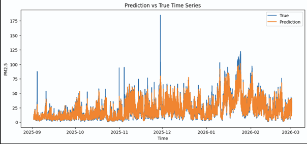
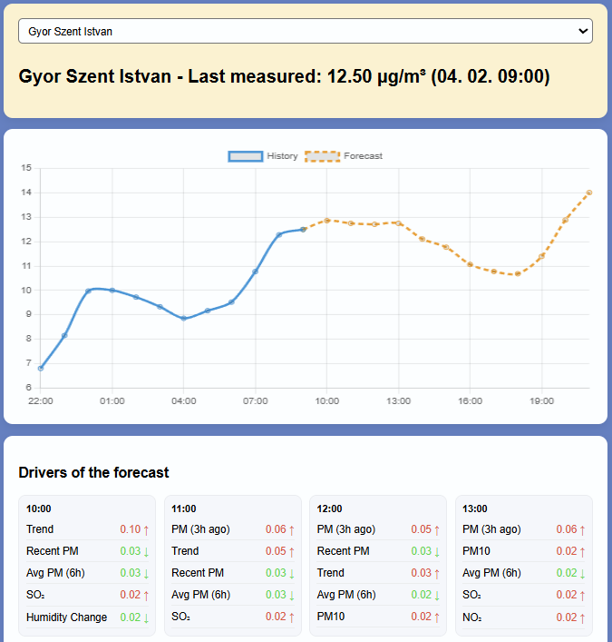

# PM2.5 Forecasting System – Győr

End-to-end machine learning system for short-term PM2.5 air pollution forecasting using time series modeling, feature engineering, and API deployment.

---

## Project Goal

- Predict PM2.5 concentration up to **12 hours ahead**
- Support environmental awareness and decision making
- Target performance: **MAE < 5 µg/m³**

More details: see [domain.md](./docs/domain.md) and [PM25_forecast_system.pdf](./docs/PM25_forecast_system.pdf)

---

## Live Demo

https://pm25-forecast.onrender.com/demo

**Features:**
- Real-time PM2.5 forecast (12h horizon)
- Interactive visualization (history + forecast)
- SHAP-based explainability for each hour

⚠️ The app may take ~30 seconds to wake up (Render free tier)
---

## Highlights

- End-to-end ML pipeline (data → model → API)
- Time-series aware validation
- Feature engineering driven performance
- Ensemble modeling for stability
- Model interpretability using SHAP
- Production-ready REST API (FastAPI)

---

## Problem Type

- Time series forecasting
- Supervised regression
- Multi-station environmental data

---

## System Architecture

1. Data ingestion (API)
2. Preprocessing  
3. Feature engineering  
4. Model training (Optuna + TimeSeriesSplit)  
5. Evaluation (metrics + SHAP)  
6. Forecasting (recursive)  
7. REST API (FastAPI)

---

## Data

**Sources:**
- Air pollution: PM2.5, NO2, PM10, SO2 (OpenAQ)
- Weather: temperature, humidity, wind, precipitation (Open-Meteo)

**Challenges:**
- Missing values
- Irregular timestamps
- Measurement noise

---

## Feature Engineering

### Time series features
- Lag features (1, 3, 6, 24 hours)
- Rolling statistics
- Trend and volatility

### Time features
- Cyclical encoding (hour, month)
- Weekend flag
- Heating season

### Weather features
- Change rates
- Physical indices (stagnation, mixing, ventilation)

### Spatial features
- Location encoding
- Normalized coordinates

---

## Models

- RandomForest
- HistGradientBoosting
- LightGBM
- XGBoost
- Ridge (baseline)

### Optimization
- Optuna
- TimeSeriesSplit (time-aware cross-validation)

---

## Validation

- Train/test split (time-based)
- Walk-forward validation (real forecasting simulation)
- Baseline comparison (lag-based model)

Ensures realistic evaluation and prevents data leakage.

---

## Evaluation

**Metrics:**
- MAE, RMSE, R²
- MAPE, SMAPE
- MASE (time-series baseline comparison)

### Key findings

- Lag features dominate predictions
- Gradient boosting models perform best
- Ensemble improves stability
- Model underestimates extreme pollution spikes

### Prediction vs True

The model closely follows the overall time series patterns, while extreme pollution spikes remain more challenging.

---

## Interpretability

- Permutation importance
- SHAP analysis

Provides insight into feature impact and model behavior.

---

## Forecasting Approach

- Recursive (autoregressive)
- Uses model predictions as future inputs
- Weather forecast integrated

---

## API

Built with FastAPI.

### Endpoint

POST /forecast

### Example request

{
  "location_name": "Gyor Szent Istvan",
  "lat": 47.6875,
  "lon": 17.6504,
  "horizon": 12
}

### Example response

{
  "location": "Gyor Szent Istvan",
  "forecast": [
    {"datetime": "...", "pm25_pred": 12.3}
  ]
}

Run locally:

uvicorn src.inference.app:app --reload

Docs:
http://127.0.0.1:8000/docs

Demo:
http://127.0.0.1:8000/demo

---

## Test Pipeline

End-to-end pipeline executable:

python run_pipeline.py

Steps:
- get_pollutants_data
- get_weather_data
- preprocessing
- training
- evaluation
- forecasting

**Key properties:**
- Separate train and inference pipelines
- No data leakage
- Fully reproducible workflow

---

## Reproducibility

Saved artifacts:
- trained model
- feature list
- location mapping

---

## Testing

- Walk-forward validation
- API test calls
- Script-based execution

---

## Limitations

- Strong dependence on lag features
- Extreme values are harder to predict
- Weather data is not station-specific
- Optimized for short horizon (1–12 hours)

---

## Future Work

- Hybrid recursive + direct multi-horizon models
- Better extreme event modeling
- Additional meteorological data
- Deep learning (LSTM / Transformers)
- Docker deployment
- Database integration
- Frontend implementation

---

## Tech Stack

### Core & Data Processing
- Python
- pandas
- numpy

### Machine Learning
- scikit-learn
- LightGBM
- XGBoost
- Optuna

### Time Series Analysis
- statsmodels

### Data Visualization
- matplotlib
- seaborn

### Model Interpretation
- SHAP

### API & Backend
- FastAPI
- Uvicorn

### Data Ingestion & External APIs
- requests
- httpx
- openaq

### Utilities
- joblib (model persistence)
- tqdm (progress tracking)
- python-dotenv (configuration)

---

## 🤖 AI Usage

AI tools (ChatGPT) were used during the project in the following ways:

- Supporting understanding of domain and time series concepts
- Assisting with Python syntax and library usage
- Rapid prototyping of own ideas (feature engineering, modeling)
- Supporting documentation writing

Important:  
AI was primarily used to accelerate the implementation of own ideas.  
All solutions were manually reviewed, validated, and adapted.  
The final implementation reflects the author's own understanding and decisions.

---

## Author

Project developed as part of a machine learning course.
